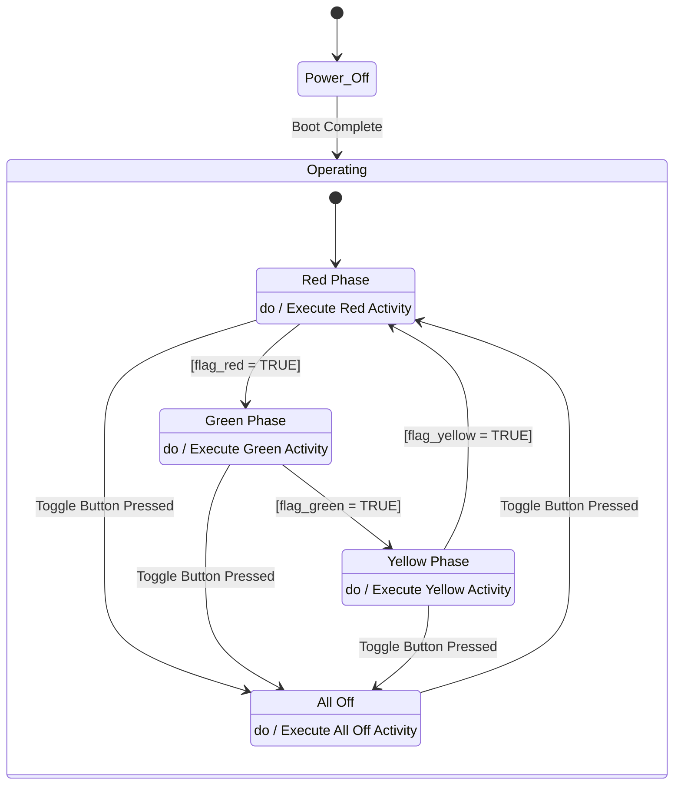
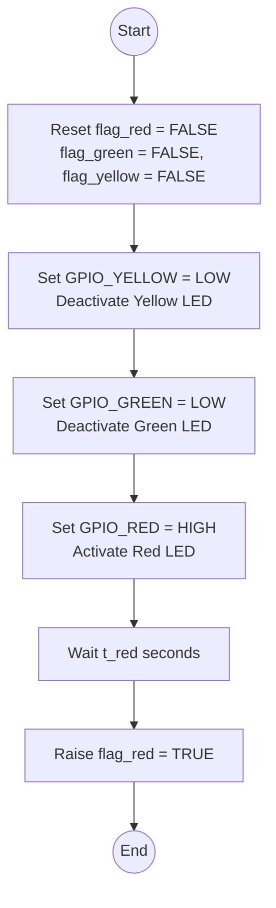
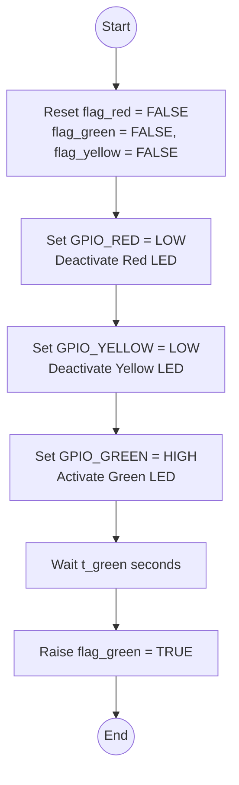
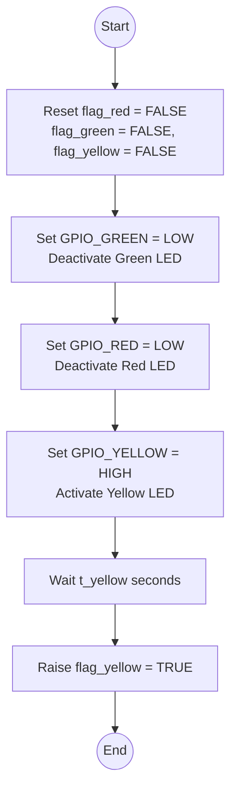

# Architectural Design

This document models the dynamic behavior of the Traffic Light System. It follows the MBSE document structure (Traceability → Description → Diagram → Specifications) and maintains hierarchical consistency between the System Level and Module Level.

---

## 1. System Level — State Machine

### Traceability

- **UC1** — Watch Traffic Light Cycle
- **UC5** — Turn Off All Lights
- **UC6** — Resume Traffic Light Cycle
- **FR-001** — Initialize Traffic Light Cycle (boot → Red_Phase)
- **FR-002** — Display Red Light Phase
- **FR-003** — Display Green Light Phase
- **FR-004** — Display Yellow Light Phase
- **FR-005** — Cycle Repetition (Yellow → Red loop)
- **FR-006** — Turn Off All Lights on Button Press
- **FR-007** — Resume Traffic Light Cycle on Button Press
- **NFR-003** — Hardware Platform (Raspberry Pi with GPIO)

### Description

The system has two top-level super-states: **Power_Off** and **Operating**. On boot, the system transitions from `Power_Off` into `Operating` and immediately enters the **Red Phase**. The system then cycles through **Red Phase → Green Phase → Yellow Phase** indefinitely. Each phase transition is triggered by the completion flag raised at the end of the corresponding activity (e.g., `flag_red = TRUE` signals the end of the red phase). From any active light phase, the operator can press the toggle button to enter the **All Off** state. A second press restarts the cycle from **Red Phase**.

### Specifications

- `t_red = 5 s` — Duration of the red light phase (NFR-002: 2 s ≤ t ≤ 5 s)
- `t_green = 5 s` — Duration of the green light phase (NFR-002: 2 s ≤ t ≤ 5 s)
- `t_yellow = 2 s` — Duration of the yellow light phase (NFR-002: 2 s ≤ t ≤ 5 s)
- Toggle button response must be ≤ 100 ms (NFR-001)
- GPIO_RED = GPIO 17, GPIO_GREEN = GPIO 27, GPIO_YELLOW = GPIO 22 (NFR-004)
- GPIO_BUTTON = GPIO 18 with software debouncing (NFR-005)

---

## 2. Module Level — Execute Red Activity

### Traceability

- **Red_Phase** state in the System Level State Machine (Section 1)
- **FR-002** — Display Red Light Phase
- **NFR-004** — LED Interface (individual GPIO pins, one active at a time)

### Description

This activity refines the `do / Execute Red Activity` action of the **Red Phase** state. It begins by resetting all trigger flags to `FALSE` to clear any stale signals. To prevent electrical conflicts, all other LEDs are then explicitly deactivated before the red LED is activated. The activity holds the red LED illuminated for the full `t_red` duration. Afterwards, `flag_red` is raised to `TRUE`, which triggers the transition from **Red Phase** to **Green Phase** in the System Level State Machine.

### Specifications

- `GPIO_RED = GPIO 17` — Raspberry Pi BCM pin for the red LED
- `GPIO_GREEN = GPIO 27` — Raspberry Pi BCM pin for the green LED
- `GPIO_YELLOW = GPIO 22` — Raspberry Pi BCM pin for the yellow LED
- All trigger flags are reset to `FALSE` as the first step of the activity, before any GPIO operation
- GPIO outputs are set LOW before HIGH to guarantee only one LED is active at any point in time, preventing simultaneous current draw (NFR-004)
- `t_red = 5 s` — Inherited from the System Level timing specification
- On `flag_red = TRUE`, the state machine transitions to **Green Phase** and `Execute Green Activity` begins

---

## 3. Module Level — Execute Green Activity

### Traceability

- **Green Phase** state in the System Level State Machine (Section 1)
- **FR-003** — Display Green Light Phase
- **NFR-004** — LED Interface (individual GPIO pins, one active at a time)

### Description

This activity refines the `do / Execute Green Activity` action of the **Green Phase** state. It begins by resetting all trigger flags to `FALSE` to clear any stale signals. All other LEDs are then deactivated before the green LED is activated to prevent electrical conflicts. After holding the green LED on for `t_green`, `flag_green` is raised to `TRUE`, triggering the transition from **Green Phase** to **Yellow Phase** in the System Level State Machine.

### Specifications

- `GPIO_RED = GPIO 17`, `GPIO_GREEN = GPIO 27`, `GPIO_YELLOW = GPIO 22` — Inherited from Section 2
- All trigger flags are reset to `FALSE` as the first step of the activity, before any GPIO operation
- GPIO outputs are set LOW before HIGH to guarantee only one LED is active at any point in time (NFR-004)
- `t_green = 5 s` — Inherited from the System Level timing specification
- On `flag_green = TRUE`, the state machine transitions to **Yellow Phase** and `Execute Yellow Activity` begins

---

## 4. Module Level — Execute Yellow Activity

### Traceability

- **Yellow Phase** state in the System Level State Machine (Section 1)
- **FR-004** — Display Yellow Light Phase
- **NFR-004** — LED Interface (individual GPIO pins, one active at a time)

### Description

This activity refines the `do / Execute Yellow Activity` action of the **Yellow Phase** state. It begins by resetting all trigger flags to `FALSE` to clear any stale signals. All other LEDs are then deactivated before the yellow LED is activated to prevent electrical conflicts. After holding the yellow LED on for `t_yellow`, `flag_yellow` is raised to `TRUE`, triggering the transition from **Yellow Phase** back to **Red Phase** in the System Level State Machine, completing one full cycle.

### Specifications

- `GPIO_RED = GPIO 17`, `GPIO_GREEN = GPIO 27`, `GPIO_YELLOW = GPIO 22` — Inherited from Section 2
- All trigger flags are reset to `FALSE` as the first step of the activity, before any GPIO operation
- GPIO outputs are set LOW before HIGH to guarantee only one LED is active at any point in time (NFR-004)
- `t_yellow = 2 s` — Inherited from the System Level timing specification
- On `flag_yellow = TRUE`, the state machine transitions back to **Red Phase**, completing the full `Red → Green → Yellow → Red` cycle (FR-005)
