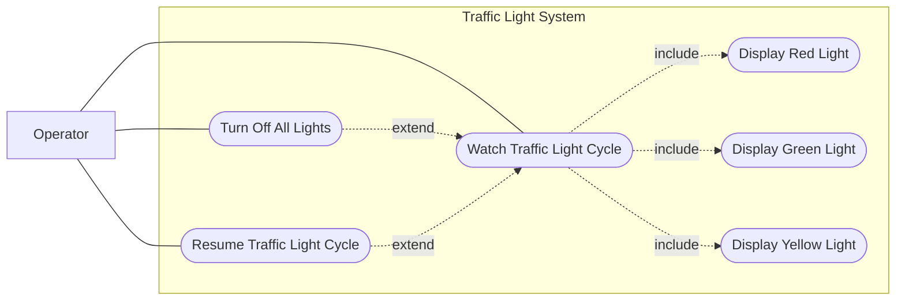

# Use Cases

This document describes the use cases for the GenAIxSysEng project.

## Traffic Light System

### External Actors
- **Operator** — The human user who interacts with the system through button presses

### Use Cases (Black-box Perspective)

From a strict black-box view, the external interactions are:

1. **UC1: Watch Traffic Light Cycle** — The system cyclically displays red, green, and yellow lights in sequence
   - **includes**: Display Red Light
   - **includes**: Display Green Light
   - **includes**: Display Yellow Light

2. **UC2: Display Red Light** — The system lights up the red LED

3. **UC3: Display Green Light** — The system lights up the green LED

4. **UC4: Display Yellow Light** — The system lights up the yellow LED

5. **UC5: Turn Off All Lights** — Operator presses the toggle button to turn off all LEDs

6. **UC6: Resume Traffic Light Cycle** — Operator presses the button again to restart the cycle from red

### Use Case Diagram

### Textual Specifications

#### UC1: Watch Traffic Light Cycle
**Actor**: System (automatic after boot)  
**Description**: The system shall cyclically display the traffic light pattern.  
**Preconditions**: System has completed boot sequence.  
**Main Flow**:
1. System displays red light
2. System displays green light
3. System displays yellow light
4. System returns to step 1 and repeats the cycle

**Postconditions**: Traffic light cycle is running continuously  
**Includes**: Display Red Light, Display Green Light, Display Yellow Light

#### UC2: Display Red Light
**Actor**: System  
**Description**: The system shall light up the red LED.  
**Preconditions**: System is executing the traffic light cycle or resuming from stopped state.  
**Main Flow**:
1. System activates red LED

**Postconditions**: Red LED is illuminated

#### UC3: Display Green Light
**Actor**: System  
**Description**: The system shall light up the green LED.  
**Preconditions**: Red light phase has completed.  
**Main Flow**:
1. System activates green LED

**Postconditions**: Green LED is illuminated

#### UC4: Display Yellow Light
**Actor**: System  
**Description**: The system shall light up the yellow LED.  
**Preconditions**: Green light phase has completed.  
**Main Flow**:
1. System activates yellow LED

**Postconditions**: Yellow LED is illuminated

#### UC5: Turn Off All Lights
**Actor**: Operator  
**Description**: The operator shall be able to turn off all LEDs by pressing the toggle button, interrupting the traffic light cycle.  
**Preconditions**: System is watching the traffic light cycle (UC1).  
**Main Flow**:
1. Operator presses the toggle button
2. System deactivates all LEDs (red, green, yellow)

**Postconditions**: All LEDs are off; traffic light cycle is paused  
**Extends**: Watch Traffic Light Cycle

#### UC6: Resume Traffic Light Cycle
**Actor**: Operator  
**Description**: The operator shall be able to restart the traffic light cycle by pressing the button again.  
**Preconditions**: All LEDs are currently off.  
**Main Flow**:
1. Operator presses the button
2. System restarts the traffic light cycle, beginning with the red light (UC2)

**Postconditions**: Traffic light cycle is running; red light is displayed  
**Extends**: Watch Traffic Light Cycle

